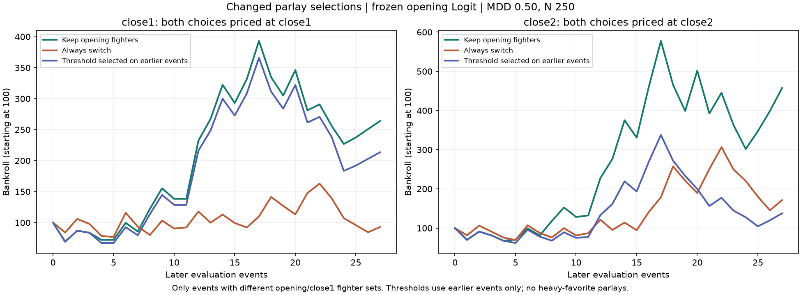

# Switching the opening parlay at close1 or close2

The historical search found a close1 candidate threshold, but the later-event
evaluation did not establish that switching improves returns. Keeping the
opening fighters, repriced at the current snapshot, performed best among the
evaluated policies on those later events.

## Data and comparison

- Saved opening Logit only; coefficients and scaler remain fixed. Its audited
  training data end May 4, 2024.
- 73 subsequent modeled events, May 11, 2024–February 21, 2026.
- **39 events** had different opening and close1 selected fighter sets. The
  other **34 were excluded**, including cases with the same legs in a different
  order. All reported return calculations use the changed-selection cohort.
- Top-two-individual-EV parlay only. No heavy-favorite parlays or moneylines.
- Shared **MDD 0.50, N 250** for all tickets, matching the configured close1
  parlay settings. This isolates selection effects from changes in risk inputs.
- At each snapshot, the opening model receives that snapshot's fair-market
  probability difference. Other features remain fixed. Parlay win probability
  is the product of the two selected leg probabilities.
- At close1, compare the opening fighters at **close1 odds and probabilities**
  against the close1-selected fighters at those same prices/probabilities.
  Recompute each ticket's stake. Repeat separately at close2; no close2 inputs
  enter a close1 decision. This assumes the ticket has not already been placed.

## The candidate rule and its units

For each candidate ticket, define:

```
EV = P(both legs win) * combined_decimal_odds - 1
expected_bankroll_return = stake_fraction * EV
gain = expected_bankroll_return(new fighters)
       - expected_bankroll_return(opening fighters repriced now)
```

Among the tested rules, the best full-history close1 result used:

**Switch if the fighters differ and gain > 0.020; otherwise keep the opening fighters.**

This is an advantage of **2 percentage points of expected bankroll return**,
not a ticket EV of 2%, and not a 2% relative improvement. For example, an
expected bankroll return of 3.5% versus 1.0% clears the threshold.

Realized percentage returns determine which threshold wins the historical
search. They never enter an individual event's switching signal. A winning
ticket returns `f * (decimal_odds - 1)` and a losing ticket returns `-f`.

On all 39 events this candidate switched four times and produced **+397.57%**
compounded return, versus **+194.62%** for keeping opening fighters at close1.
These figures use the same events that selected the threshold and are therefore
descriptive. They do not independently validate that 0.020 threshold.

If the rule must use EV per dollar staked alone, the best tested close1
threshold was **new EV minus repriced-opening EV > 0.05** (five percentage
points), with 15 switches and +244.01% retrospective compounded return.
The bankroll-return rule explicitly accounts for the different stake sizes.

At close2, several thresholds tied because they all selected just one switch:
expected-bankroll-return gain thresholds from **4.0 to 8.5 percentage points**
on the tested grid. This does not identify a stable, precise optimum.

## Later-event evaluation

The first 12 changed-selection events initialize threshold selection. Rules are
then selected using only earlier events and frozen for the next calendar
quarter. The remaining **27 events**, October 12, 2024–February 21, 2026, form
the chronological evaluation. The first block starts partway through a quarter.
The full-history 0.020 threshold is not retroactively substituted into these
test results.

| Decision snapshot and policy | Switches | Mean event bankroll return | Compounded return |
| --- | ---: | ---: | ---: |
| Close1: keep opening fighters | 0 | +5.67% | **+164.01%** |
| Close1: always switch | 27 | +1.49% | −7.08% |
| Close1: threshold selected on earlier events | 2 | +5.02% | +113.52% |
| Close2: keep opening fighters | 0 | +8.75% | **+357.48%** |
| Close2: always switch when fighters differ | 24 | +4.89% | +71.58% |
| Close2: threshold selected on earlier events | 7 | +4.17% | +37.64% |

Close1's learned thresholds ranged from 1.5 to 2.5 percentage points of
expected-bankroll-return gain. Despite this relatively narrow range, their
later-event results did not beat keeping the opening fighters. The close2
rules were less stable. All policies use identical evaluation events within
each comparison. In three of the 27 close2 events, opening and close2 choices
matched, so there was no switch to make.



## Opening, close1 and close2 selected tickets

For completeness, selecting the ticket at each snapshot and taking that
snapshot's original price gives these descriptive results on the same 39 events:

| Snapshot | Profitable events | Mean event return | Compounded return |
| --- | ---: | ---: | ---: |
| Opening | 22 | +10.83% | +2034.20% |
| Close1 | 17 | +1.50% | −4.19% |
| Close2 | 17 | +4.54% | +108.67% |

The opening row is **not an executable switching benchmark**: it uses old
opening prices, and inclusion in this table depends on the later close1
selection changing. The current-price comparison above is the relevant one
for the requested decision rule.

## Interpretation and files

The useful finding is a candidate signal to investigate: a sufficiently large
increase in expected bankroll return after sizing. The data do **not** establish
an optimal live switching threshold. Only four events drive the full-sample
close1 candidate's switches, and the chronological selector did worse than
keeping the opening fighters. The event bootstrap intervals are exploratory;
they do not demonstrate positive incremental returns from the learned rule.

Results are conditional on the modeled fights available in the CSVs, not
necessarily every fight on each card. Historical outcomes have also been
examined in prior analyses. Model probabilities and their product assumption
are estimates. Different MDD/N settings would require reevaluating a threshold
expressed in expected bankroll-return units.

- `changed_selection_events.csv`: selected fighters, prices, probability, EV,
  stake fraction, expected and realized returns for every comparison.
- `excluded_same_fighters.csv`: excluded events, without scored returns.
- `retrospective_threshold_grid.csv`: every tested rule, including keep/switch
  baselines. Values and thresholds are fractions, not percentage points.
- `selected_rules_by_quarter.csv`: actual rules chosen using earlier events.
- `heldout_event_returns.csv` and `heldout_metrics.csv`: chronological results.
- `paired_event_bootstrap.csv`: paired incremental-return diagnostics.
- `methodology.json`: model audit and assumptions.

Reproduce with `python -m ufc_betting.Models.RiskManagement.parlay_switch_evaluation`
in the project's scientific Python environment. Three focused tests cover
fighter-side selection, repricing/settlement, and exclusion of future outcomes
from threshold selection.
