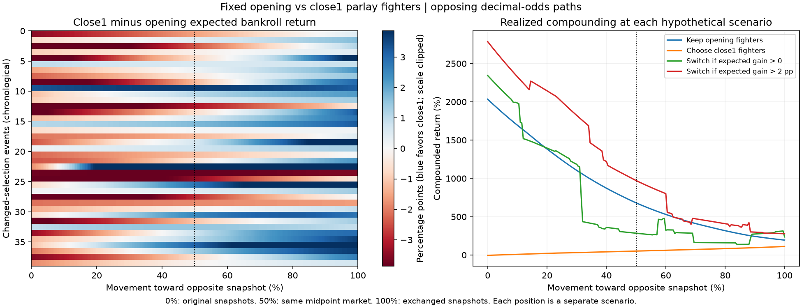

# Opposing-odds parlay sensitivity

Across the 39 changed-selection events, the close1 ticket's **average expected
bankroll return first overtakes the opening ticket at 46.5% movement** on the
evaluated grid. This is an average model-implied crossover, not one optimal
switching point for every event or a validated profit-maximizing rule.

## Exactly what moves

The opening and close1 fighter selections are fixed at their original snapshots.
At movement fraction `t`:

```
Opening-selected ticket: opening decimal odds + t * (close1 odds - opening odds)
Close1-selected ticket: close1 decimal odds + t * (opening odds - close1 odds)
```

This is linear in individual-leg **decimal odds**, not American odds. For each
selected fight, both red and blue quotes move along the path so that fair
probabilities can be recomputed. The fixed opening Logit uses the resulting
power-devig market feature. Model coefficients remain unchanged. Each ticket's
win probability, EV, MDD/Kelly stake, expected bankroll return, and realized
bankroll return are recalculated. MDD=0.50 and N=250 throughout.

- **0%:** opening selections at opening odds; close1 selections at close1 odds.
- **50%:** both ticket calculations use the same midpoint market.
- **100%:** opening selections at close1 odds; close1 selections at opening odds.

These are two hypothetical ticket-specific markets. When the parlays share a
fighter, that fighter can have a different quote in each ticket away from 50%.
The same-quote midpoint is the only common market along this opposing-path
construction. This differs from the previous comparison that priced both
tickets at close1 throughout.

Only the 39 events where original opening and close1 fighter sets differed are
scored. The other 34 are excluded. No fighters are reselected along the path,
even if another fighter's EV becomes higher. No heavy-favorite parlays are used.

## Event-level switching rule

At each point calculate:

```
gain = close1_ticket_stake_fraction * close1_ticket_EV
       - opening_ticket_stake_fraction * opening_ticket_EV
```

Two comparisons are provided:

1. **Expected-return crossover:** choose close1 when `gain > 0`.
2. **Earlier candidate margin:** choose close1 only when `gain > 0.02`.

The second requires an advantage greater than two percentage points of expected
bankroll return. It was a retrospective candidate from the previous analysis;
applying it to these hypothetical paths does not independently validate it.

| Movement | Close1 has positive expected gain | Close1 exceeds the 2-point margin |
| --- | ---: | ---: |
| 0% | 6 / 39 | 1 / 39 |
| 25% | 11 / 39 | 2 / 39 |
| 50% | 20 / 39 | 5 / 39 |
| 75% | 30 / 39 | 10 / 39 |
| 100% | 35 / 39 | 18 / 39 |

For the average event, close1's expected advantage is −2.02 percentage points
at the start, +0.145 at the midpoint, and +1.943 at full exchange. The average
does not clear the 2-point margin anywhere on this grid.

Of the 35 events that ever favor close1, six favor it immediately. Four events
never favor close1. With the 2-point margin, 18 ever qualify, one qualifies
immediately, and 21 never qualify. No multiple disjoint switching regions were
found on the 0.5-percentage-point grid; the interval file nevertheless preserves
all regions rather than assuming a single crossing.

Examples (percentage of the odds-path distance):

| Event | Opening fighters | Close1 fighters | First positive gain | First gain above 2 pp |
| --- | --- | --- | ---: | ---: |
| 2024-05-11 | Rodrigo Nascimento + Sean Woodson | Joaquin Buckley + Sean Woodson | 88.5% | Never |
| 2024-06-29 | Ian Machado Garry + Joe Pyfer | Gillian Robertson + Ian Machado Garry | 60.5% | 82.0% |
| 2024-08-03 | Rolando Bedoya + Viktoriia Dudakova | Rolando Bedoya + Sedriques Dumas | 44.5% | 95.5% |
| 2024-09-07 | Steve Garcia + Trevor Peek | Jaqueline Amorim + Steve Garcia | Already at 0% | Already at 0% |

Crossings are the first qualifying grid points, accurate to the 0.5-point
movement resolution, not exact mathematical roots. A blank first-switch cell
means the rule never qualifies along the evaluated path.

## Realized percentage returns

Every scenario settles the tickets against the actual outcomes and compounds
the selected returns in event-date order. Each movement percentage is a
**separate historical scenario**, not an additional sequence of bets.

At the common-market midpoint (50%):

| Policy | Switches | Mean realized event return | Compounded return |
| --- | ---: | ---: | ---: |
| Keep opening fighters | 0 | +7.74% | +680.75% |
| Always choose close1 fighters | 39 | +3.28% | +51.21% |
| Choose close1 when expected gain > 0 | 20 | +6.08% | +284.45% |
| Choose close1 when expected gain > 2 pp | 5 | +8.77% | +972.26% |

Thus a model-implied expected-return crossover is not the same thing as an
empirically optimal switching point. The 2-point rule happens to do well at
the midpoint in this retrospective scenario, but all scenarios reuse the same
39 outcomes and the threshold was already selected using those outcomes.



## Outputs and reproduction

- `event_switch_intervals.csv`: each event's original selections, first switch
  percentages, all qualifying intervals, and expected gains at 0/50/100%.
- `leg_prices_and_probabilities.csv`: individual decimal quotes and probabilities
  at each path position, so a switching point can be translated into actual lines.
- `event_paths.csv`: both tickets' odds, probability, stake, EV and returns at
  all 201 positions. Return and EV columns use fractions (0.02 = 2%).
- `scenario_returns.csv`: realized and expected returns by scenario and policy.
- `methodology.json`: full assumptions and model training-date audit.

Run `python -m ufc_betting.Models.RiskManagement.parlay_switch_sensitivity`.
Five focused tests passed, including opposing endpoints, the common midpoint,
fixed fighter choices, threshold interval handling, and chronological selection
from the preceding analysis. The saved opening model was trained through
May 4, 2024; these modeled evaluation events are later. Available modeled fights
may not include every fight on a card.
